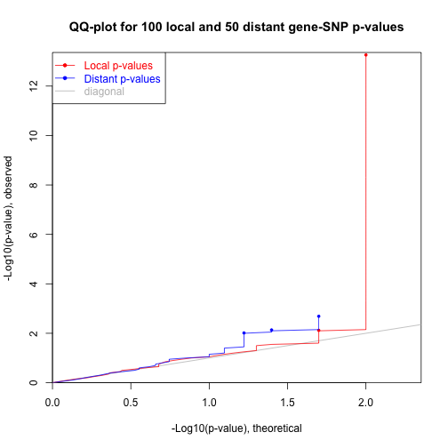
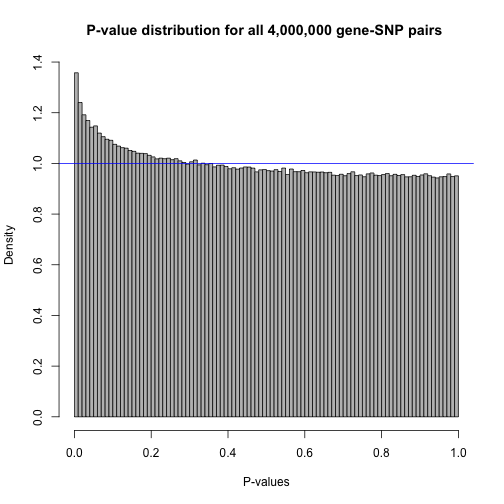
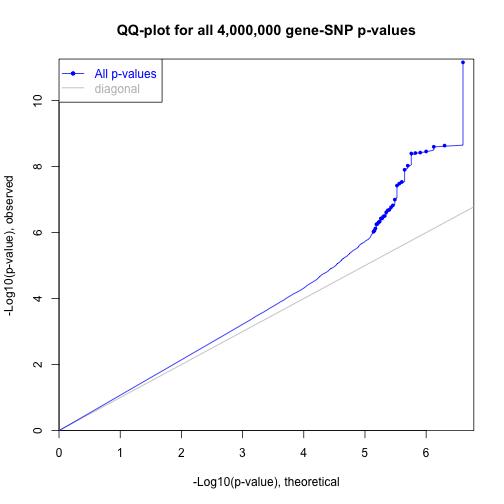

#Start with http://www.bios.unc.edu/research/genomic_software/Matrix_eQTL/runit.html#inst


```r
#setwd("~/Documents/Postdoc_Works/eQTL_Stroke")
#install.packages("MatrixEQTL")
```

#Download the sample code and put it on Input folder
#Have 16 samples, 15 SNPs and 10 Genes expression
#Also we need to have the location of each SNP and each genes including the chr number and right left distance for each gene as well as chr number and pos for each SNP
#Covariants based on gender and age


```r
#For updating the package
#source("~/Documents/Postdoc_Works/eQTL_Stroke/Input/MatrixEQTL/R/Matrix_eQTL_engine.R")
library(MatrixEQTL)
```

```
## 
## Attaching package: 'MatrixEQTL'
```

```
## The following objects are masked _by_ '.GlobalEnv':
## 
##     Matrix_eQTL_engine, Matrix_eQTL_main, SlicedData
```

```r
#base.dir = find.package('MatrixEQTL') 
base.dir <- ("~/Documents/Postdoc_Works/eQTL_Stroke/Input/MatrixEQTL")
```


```r
##setting
#Linear model to use, modelANOVA, modelLINEAR, or modelLINEAR_CROSS
useModel = modelLINEAR; # modelANOVA, modelLINEAR, or modelLINEAR_CROSS

# Genotype file name
SNP_file_name = paste(base.dir, "/data/SNP.txt", sep="");
snps_location_file_name = paste(base.dir, "/data/snpsloc.txt", sep="");

# Gene expression file name
expression_file_name = paste(base.dir, "/data/GE.txt", sep="");
gene_location_file_name = paste(base.dir, "/data/geneloc.txt", sep="");

# Covariates file name
# Set to character() for no covariates
covariates_file_name = paste(base.dir, "/data/Covariates.txt", sep="");
```


```r
# Output file name
output_file_name_cis = tempfile();
output_file_name_tra = tempfile();
```


```r
#The p-value threshold determines which gene-SNP associations are saved in the output file output_file_name. Note that for larger datasets the threshold should be lower. Setting the threshold to a high value for a large dataset may cause excessively large output files.
# Only associations significant at this level will be saved
pvOutputThreshold_cis = 2e-2;
pvOutputThreshold_tra = 1e-2;
```


```r
#Finally, define the covariance matrix for the error term. This parameter is rarely used.
# Set to numeric() for identity.
errorCovariance = numeric();
# Error covariance matrix
# errorCovariance = read.table("Sample_Data/errorCovariance.txt");

# Distance for local gene-SNP pairs
cisDist = 1e6;
```


```r
# The next section of the sample code contains three very similar parts loading the files with genotype, gene expression, and covariates. In each part one can set the file delimiter (i.e. tabulation "\t", comma ",", or space " "), the string representation for missing values, the number of rows with column labels, and the number of columns with row labels.	Finally, one can change the number of the variables in a slice for the file reading procedure (do not change if not sure).

## Load genotype data
snps = SlicedData$new() #SlicedData object with genotype information.
snps$fileDelimiter = "\t"      # the TAB character
snps$fileOmitCharacters = "NA"; # denote missing values;
snps$fileSkipRows = 1;          # one row of column labels
snps$fileSkipColumns = 1;       # one column of row labels
snps$fileSliceSize = 2000;      # read file in slices of 2,000 rows
snps$LoadFile(SNP_file_name); #Number of columns: 16, Number of rows: 15
```

```
## Warning in file(description = filename, open = "rt", blocking = FALSE,
## raw = FALSE): cannot open file '/Users/hajaramini/Documents/Postdoc_Works/
## eQTL_Stroke/Input/MatrixEQTL/data/SNP.txt': No such file or directory
```

```
## Error in file(description = filename, open = "rt", blocking = FALSE, raw = FALSE): cannot open the connection
```


```r
## Load gene expression data
gene = SlicedData$new(); #SlicedData object with gene expression information. Must have columns matching those of snps, create gene including row and column
gene$fileDelimiter = "\t";      # the TAB characte
gene$fileOmitCharacters = "NA"; # denote missing values;
gene$fileSkipRows = 1;          # one row of column labels
gene$fileSkipColumns = 1;       # one column of row labels
gene$fileSliceSize = 2000;      # read file in slices of 2,000 rows
gene$LoadFile(expression_file_name); #Number of columns: 16, Number of rows: 10 
```

```
## Warning in file(description = filename, open = "rt", blocking = FALSE,
## raw = FALSE): cannot open file '/Users/hajaramini/Documents/Postdoc_Works/
## eQTL_Stroke/Input/MatrixEQTL/data/GE.txt': No such file or directory
```

```
## Error in file(description = filename, open = "rt", blocking = FALSE, raw = FALSE): cannot open the connection
```


```r
## Load covariates
cvrt = SlicedData$new();
cvrt$fileDelimiter = "\t";      # the TAB character
cvrt$fileOmitCharacters = "NA"; # denote missing values;
cvrt$fileSkipRows = 1;          # one row of column labels
cvrt$fileSkipColumns = 1;       # one column of row labels
if(length(covariates_file_name)>0) {
cvrt$LoadFile(covariates_file_name);
}
```

```
## Warning in file(description = filename, open = "rt", blocking = FALSE,
## raw = FALSE): cannot open file '/Users/hajaramini/Documents/Postdoc_Works/
## eQTL_Stroke/Input/MatrixEQTL/data/Covariates.txt': No such file or
## directory
```

```
## Error in file(description = filename, open = "rt", blocking = FALSE, raw = FALSE): cannot open the connection
```


```r
## Run the analysis
snpspos = read.table(snps_location_file_name, header = TRUE, stringsAsFactors = FALSE);
```

```
## Warning in file(file, "rt"): cannot open file '/Users/hajaramini/Documents/
## Postdoc_Works/eQTL_Stroke/Input/MatrixEQTL/data/snpsloc.txt': No such file
## or directory
```

```
## Error in file(file, "rt"): cannot open the connection
```

```r
genepos = read.table(gene_location_file_name, header = TRUE, stringsAsFactors = FALSE);
```

```
## Warning in file(file, "rt"): cannot open file '/Users/hajaramini/Documents/
## Postdoc_Works/eQTL_Stroke/Input/MatrixEQTL/data/geneloc.txt': No such file
## or directory
```

```
## Error in file(file, "rt"): cannot open the connection
```


```r
#Finally, the main Matrix eQTL function is called:
me = Matrix_eQTL_main(
snps = snps, 
gene = gene, 
cvrt = cvrt,
output_file_name = output_file_name_tra,
pvOutputThreshold = pvOutputThreshold_tra,
useModel = useModel, 
errorCovariance = errorCovariance, 
verbose = TRUE, #logical. Set to TRUE to display more detailed report about the progress
output_file_name.cis = output_file_name_cis,
pvOutputThreshold.cis = pvOutputThreshold_cis,
snpspos = snpspos, 
genepos = genepos,
cisDist = cisDist,
pvalue.hist = "qqplot", #logical, numerical, or "qqplot".Defines whether and how the distribution of p-values is recorded in the returned object.If pvalue.hist = FALSE, the information is not recorded and the analysis is performed faster. Alternatively, set pvalue.hist = "qqplot" to record information sufficient to create a QQ-plot of the p-values (use plot on the returned object to create the plot).To record information for a histogram set pvalue.hist to the desired number of bins of equal size.	Finally, pvalue.hist can also be set to a custom set of bin edges.
min.pv.by.genesnp = FALSE, #logical. Set min.pv.by.genesnp = TRUE to record the minimum p-value for each SNP and each gene in the returned object. The minimum p-values are recorded even if if they are above the corresponding thresholds of pvOutputThreshold and pvOutputThreshold.cis. The analysis runs faster when the parameter is set to FALSE.
noFDRsaveMemory = FALSE); #logical. Set noFDRsaveMemory = TRUE to save significant gene-SNP pairs directly to the output files, reduce memory footprint and skip FDR calculation. The eQTLs are not recorded in the returned object if noFDRsaveMemory = TRUE.
```

```
## Error in Matrix_eQTL_main(snps = snps, gene = gene, cvrt = cvrt, output_file_name = output_file_name_tra, : Empty genotype dataset
```

```r
#Each significant gene-SNP association is recorded in a separate line in the output file and in the returned object me. In case of cis/trans eQTL analysis, two output files are produced, one with cis-eQTLs, another only with trans. Every record contains a SNP name, a transcript name, estimate of the effect size, t- or F-statistic, p-value, and FDR.
#100.00% done, 2 cis-eQTLs, 3 trans-eQTLs. Task finished in  0.035  seconds
unlink(output_file_name_cis);
unlink(output_file_name_tra);
```


```r
## Results
cat('Analysis done in: ', me$time.in.sec, ' seconds', '\n');
```

```
## Analysis done in:  0.067  seconds
```

```r
cat('Detected local eQTLs:', '\n');
```

```
## Detected local eQTLs:
```

```r
show(me$trans$eqtls)
```

```
##     snps    gene statistic      pvalue       FDR       beta
## 1 Snp_13 Gene_09 -3.914403 0.002055817 0.1027908 -0.2978847
## 2 Snp_11 Gene_06 -3.221962 0.007327756 0.1619451 -0.2332470
## 3 Snp_14 Gene_01  3.070005 0.009716705 0.1619451  0.2147077
```

```r
#  snps    gene statistic      pvalue       FDR       beta
# 1 Snp_13 Gene_09 -3.914403 0.002055817 0.1027908 -0.2978847
# 2 Snp_11 Gene_06 -3.221962 0.007327756 0.1619451 -0.2332470
# 3 Snp_14 Gene_01  3.070005 0.009716705 0.1619451  0.2147077
cat('Detected distant eQTLs:', '\n');
```

```
## Detected distant eQTLs:
```

```r
show(me$cis$eqtls)
```

```
##     snps    gene statistic       pvalue          FDR      beta
## 1 Snp_05 Gene_03 38.812160 5.515519e-14 5.515519e-12 0.4101317
## 2 Snp_04 Gene_10  3.201666 7.608981e-03 3.804491e-01 0.2321123
```

```r
#     snps    gene statistic       pvalue          FDR      beta
# 1 Snp_05 Gene_03 38.812160 5.515519e-14 5.515519e-12 0.4101317
# 2 Snp_04 Gene_10  3.201666 7.608981e-03 3.804491e-01 0.2321123
```

```r
## Plot the Q-Q plot of local and distant p-values
plot(me)
```




```r
#Create an artificial dataset and plot the histogram and Q-Q plot of all p-values
#library('MatrixEQTL')
# Number of samples
n = 100;

# Number of variables
ngs = 2000;

# Common signal in all variables (population stratification)
pop = 0.2 * rnorm(n);

# data matrices
snps.mat = matrix(rnorm(n*ngs), ncol = ngs) + pop;
gene.mat = matrix(rnorm(n*ngs), ncol = ngs) + pop + snps.mat*((1:ngs)/ngs)^9/2;

# data objects for Matrix eQTL engine
snps1 = SlicedData$new( t( snps.mat ) );
gene1 = SlicedData$new( t( gene.mat ) );
cvrt1 = SlicedData$new( );
rm(snps.mat, gene.mat)

# Slice data in blocks of 500 variables
snps1$ResliceCombined(500);
gene1$ResliceCombined(500);

# name of temporary output file
filename = tempfile();

# Perform analysis recording information for 
# a histogram
meh = Matrix_eQTL_engine(
  snps = snps1,
  gene = gene1,
  cvrt = cvrt1,
  output_file_name = filename, 
  pvOutputThreshold = 1e-100, 
  useModel = modelLINEAR, 
  errorCovariance = numeric(), 
  verbose = TRUE,
  pvalue.hist = 100);
```

```
## Processing covariates 
## Task finished in  0.004  seconds
## Processing gene expression data (imputation, residualization, etc.) 
## Task finished in  0.028  seconds
## Creating output file(s) 
## Task finished in  0.01  seconds
## Performing eQTL analysis 
##  6.25% done, 0 eQTLs
## 12.50% done, 0 eQTLs
## 18.75% done, 0 eQTLs
## 25.00% done, 0 eQTLs
## 31.25% done, 0 eQTLs
## 37.50% done, 0 eQTLs
## 43.75% done, 0 eQTLs
## 50.00% done, 0 eQTLs
## 56.25% done, 0 eQTLs
## 62.50% done, 0 eQTLs
## 68.75% done, 0 eQTLs
## 75.00% done, 0 eQTLs
## 81.25% done, 0 eQTLs
## 87.50% done, 0 eQTLs
## 93.75% done, 0 eQTLs
## 100.00% done, 0 eQTLs
## Task finished in  0.591  seconds
## 
```

```r
unlink( filename );
# png(filename = "histogram.png", width = 650, height = 650)
plot(meh, col="grey")
```



```r
# dev.off();
```

```r
# Perform the same analysis recording information for 
# a Q-Q plot
meq = Matrix_eQTL_engine(
snps = snps1, 
gene = gene1, 
cvrt = cvrt1, 
output_file_name = filename,
pvOutputThreshold = 1e-6, 
useModel = modelLINEAR, 
errorCovariance = numeric(), 
verbose = TRUE,
pvalue.hist = "qqplot");
```

```
## Processing covariates 
## Task finished in  0  seconds
## Processing gene expression data (imputation, residualization, etc.) 
## Task finished in  0.019  seconds
## Creating output file(s) 
## Task finished in  0.008  seconds
## Performing eQTL analysis 
##  6.25% done, 4 eQTLs
## 12.50% done, 4 eQTLs
## 18.75% done, 4 eQTLs
## 25.00% done, 5 eQTLs
## 31.25% done, 6 eQTLs
## 37.50% done, 11 eQTLs
## 43.75% done, 12 eQTLs
## 50.00% done, 12 eQTLs
## 56.25% done, 12 eQTLs
## 62.50% done, 12 eQTLs
## 68.75% done, 19 eQTLs
## 75.00% done, 20 eQTLs
## 81.25% done, 20 eQTLs
## 87.50% done, 21 eQTLs
## 93.75% done, 22 eQTLs
## 100.00% done, 29 eQTLs
## Task finished in  0.955  seconds
## 
```

```r
unlink( filename );
# png(filename = "QQplot.png", width = 650, height = 650)
plot(meq, pch = 16, cex = 0.7)
```



```r
# dev.off();
```
# Analyzing my own data
# To analyze my own data one simply take one of the code samples and replace references to the toy data set with those to real data. This may involve up to all five files in the toy data set:
# genotype
# expression
# covariates
# gene location
# SNP location
#The first three data files must have columns corresponding to samples and with one gene/SNP/covariate in each row. The columns of all three files must have matching order. All measurements must be numeric and the values in the genotype data set do not have to be descrete.
#Analyzing your own LARGE data (BLAS), have to figure out which version better for macos
